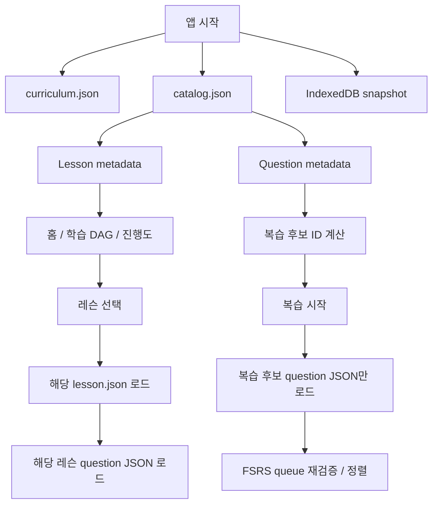

# 콘텐츠 로딩 구조

Beaura의 authored content는 빌드 단계에서 정적 JSON으로 변환되며, 런타임에서는 화면에 필요한 범위만 읽는다. 오프라인 지원을 위해 서비스 워커는 전체 generated content를 캐시하지만 설치 중 요청 폭주를 피하도록 작은 배치로 나누어 저장한다.

## generated 산출물

- `curriculum.json`: 트랙과 prerequisite DAG
- `catalog.json`: 화면 탐색과 복습 후보 계산에 필요한 경량 lesson/question metadata
- `lessons/{id}.json`: 설명 블록과 question reference를 포함한 실제 레슨 본문
- `questions/{id}.json`: 실제 문제 본문과 정답/설명
- `manifest.json`: build ID와 전체 content ID 목록

`catalog.json`의 lesson 항목은 `id`, `revision`, `track`, `title`, `description`만 포함한다. question 항목은 `id`, `revision`, `lessonId`만 포함한다. 레슨 본문, Markdown HTML, 문제 prompt/선택지/해설은 catalog에 넣지 않는다.

## 화면별 로딩 정책

홈, 학습 경로, 진행도 화면은 `curriculum.json`, `catalog.json`, IndexedDB snapshot만으로 구성한다. 앱 시작 시 모든 lesson/question JSON을 hydrate하지 않는다.

레슨 플레이어는 사용자가 선택한 `lesson.json`과 그 lesson flow가 참조하는 question JSON만 로드한다. 다른 레슨 본문은 가져오지 않는다.

복습 화면의 초기 진입에서는 catalog와 저장된 `QuestionState`를 비교해 due 또는 revision 변경 가능성이 있는 문제의 metadata만 고른다. 사용자가 복습 시작을 누르면 해당 후보의 실제 question JSON을 로드하고 `LearningRepository.getReviewQueue()`로 revision 처리와 FSRS 우선순위를 다시 검증한 뒤 review limit를 적용한다.

## 오프라인 캐시

서비스 워커는 installed release가 완전한 오프라인 콘텐츠를 갖도록 generated content 전체를 precache한다. 단, `Cache.addAll()`에 전체 파일 목록을 한 번에 넘기지 않고 12개 단위 배치로 순차 처리한다. 따라서 오프라인 완전성은 유지하면서 설치 시 동시 네트워크 요청 수를 제한한다.
